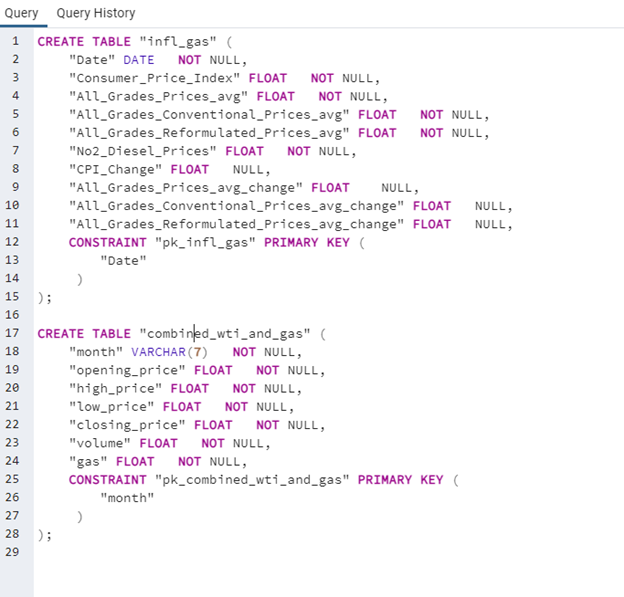
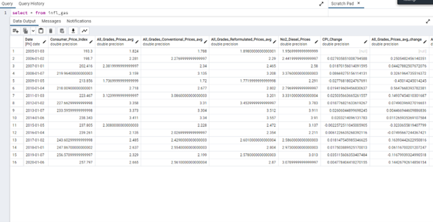
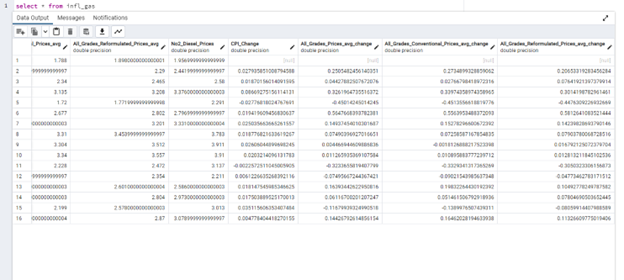
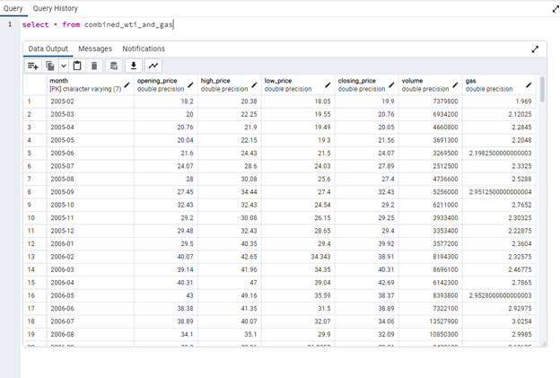

# project2

Extract information from two csv files and one api, transform and merge the three data sets and to upload them to a database (PG Admin)

## Group 1 Proposal:

The subject we are pursuing is the correlation between the inflation in the United States, and the price ranges of gasoline and/or crude oil over the last fifteen years, beginning in the year 2005 and stopping at 2020. We also want to investigate the prices provided by West Texas Intermediate gathered from the Alpha Vantage API for a monthly average comparison to U.S. gas prices.

The gas/diesel csv data is recorded weekly on Mondays, and the inflation data provided by Kaggle covers only the first twelve days into the month of January each given year in it's dataset.
In the process of performing ETL, we would be filtering the daily-recorded US. Inflation data to match up with the recorded-by-week rows in the U.S. Gasoline and Diesel data. We would be aggregating both lists into a single table using the dates as the join. 

Questions we could potentially ask, is there a correlation to higher inflation to WTI stock and gasoline prices? Do the yearly percentage changes for the factors of inflation, gas pricing and the WTI price correlate? Do gas prices follow inflation?

## Process
 Loading both U.S. Inflation Data csv and U.S. Gasoline csv into Jupyter Notebook/Pandas Dataframe to clean and filter both datasets before merging them using their row dates as an inner join. Afterward we filtered the merged table to include only the first Mondays of each year in our targetted range to help us build an assessment by year, and then generating new columns which calculated the percentage changes between the CPI, All Grades/Formulations gas prices, All Grades/Conventional gas prices and All Grades/Reformulated gas prices. We have removed the columns listing the prices for Regular, Midgrade and Premium gas, as we did not intend to utilize that data. 

The code for cleaning the CPI and Gas Price csv files is labelled 'infl_gas.ipynb'. The resulting dataframe was exported to csv to upload later to SQL under the name 'gas_cpi' in the folder 'cleaning_results.'

Using the Alpha Vantage API we called the WTI stock data, this data was used as an example cost of a barrel of crude oil. The data was then put into a data frame and exported as a CSV. The data required cleaning and formatting so that it could be merged with other data. The column labelled monthly_time series and was required to be split into five separate columns.  Erroneous data was removed from the dataframe using the dropna function. Once this was done, the data was sorted by date and a column for month was added to the data frame for aggregation. We wanted to compare this data with cost average cost of a gallon of gas each month. To do this, we used the gas price CSV from Kaggle. To match up with the WTI data, the csv was filtered from a weekly reporting format to a monthly average throughtout the dataset. This was done by calculating the average of the months using groupby. Extra dates that did not match the Stock data were removed from the dataframe and columns containing anything except the average overall cost of gas were removed as well to properly merge both datasets. After this was done, we merged both datasets. This code used for cleaning and merging the datasets is labelled 'wti_cleaning.ipynb' and 'stock_gas.ipynb.' The resulting merged table was exported to csv labelled 'combined_wti_and_gas.csv.'

### Database upload

We first generated the two tables that we would construct in PG Admin using the free database diagram generation website. Our resulting SQL code is the following:

*Screehshot of code used for database table construction*

After constructing the tables in PG Admin SQL, we used Jupyter Notebook code to append both tables to contain the data from both merged datasets. The code that we used to for uploading is in the file labelled: 'infl_gas_db_sql.ipynb'. 

After making the uploads we tested to make sure that our tables contained the required data. We succeed with the results posted below.

## Database Screenshots

*First Screehshot of infl_gas database table*

*Second Screehshot of infl_gas database table*

*Screehshot of combined_wti_and_gas_database database table*

## Sources

The data that we are drawing from consists of the following:

The AlphaVantage API was used to call monthly stock data from WTI based on the ticker symbol. https://www.alphavantage.co/

“U.S. Inflation Data, CPI for All Urban Consumers (CPI-U)|Average of all cities.” Arpit Verma, Kaggle, https://wwwkaggle.com/datasets/varpit94/us-inflation-data-updated-till-may-2021 Accessed 12/15/2022

“U.S. Gasoline and Diesel Retail Prices 1995-2021|Weekly Retail Gasoline and Diesel Prices” Mau Rua, Kaggle,  https://www.kaggle.com/datasets/mruanova/us-gasoline-and-diesel-retail-prices-19952021
Accessed 12/15/2022

