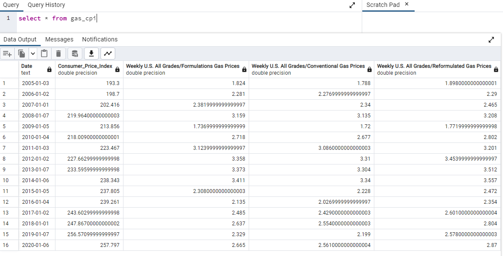
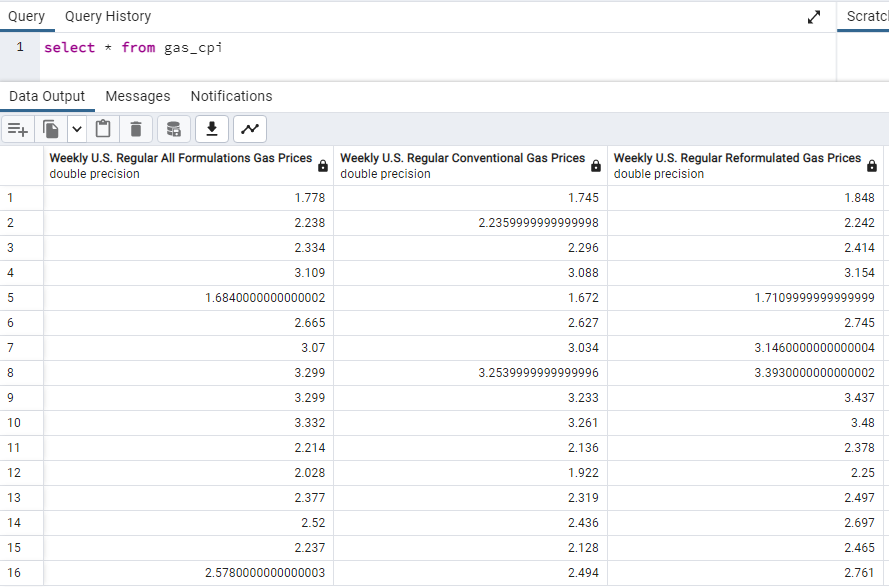
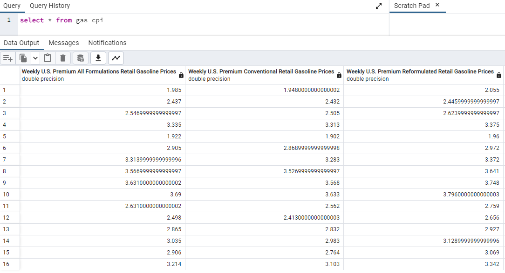
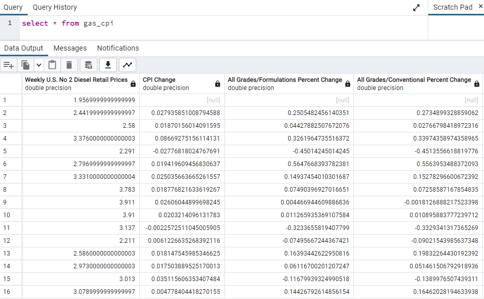
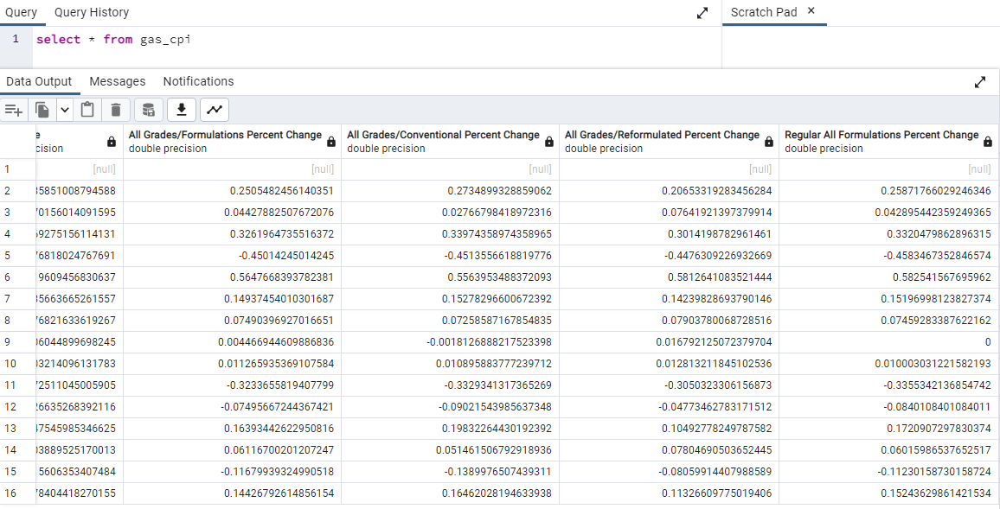

# project2

Extract information from two csv files and one api, transform and merge the three data sets and to upload them to a database (PG Admin)

## Group 1 Proposal:

The subject we are pursuing is the correlation between the inflation in the United States, and the price ranges of gasoline and/or crude oil over the last fifteen years, beginning in the year 2005 and stopping at 2020. We also want to investigate the prices provided by West Texas Intermediate API gathered from Alpha Vantage for a quarterly average comparison to U.S. gas prices.

The gas/diesel csv data is recorded weekly on Mondays, and the inflation data provided by Kaggle covers only the first twelve days into the month of January each given year in it's dataset.
In the process of performing ETL, we would be filtering the daily-recorded US. Inflation data to match up with the recorded-by-week rows in the U.S. Gasoline and Diesel data. We would be aggregating both lists into a single table using the dates as the join. 

Questions we could potentially ask, is there a correlation to higher inflation to WTI stock and gasoline prices? Do the yearly percentage changes for the factors of inflation, gas pricing and the WTI price correlate? Do gas prices follow inflation?

## Roles
James: Loading both U.S. Inflation Data csv and U.S. Gasoline csv into Jupyter Notebook and into Pandas Dataframe to clean and filter both datasets before merging them both using their row dates as a join. Afterward filtered the merged table to include only the first Mondays of each year in range as an assessment by year, and then generating new columns which calculated the percentage changes between the CPI, All Grades/Formulations gas prices, All Grades/Conventional gas prices and All Grades/Reformulated gas prices. We have also included a percentage change column displaying for U.S. Regular All Formulations gas prices. 

Codes for cleaning and uploading from James are labelled 'infl_gas.ipynb' and 'infl_gas_db_sql.ipynb' respectively. 

Connor: Loading West Texas 

## Sources

The data that we are drawing from consists of the following:

•	“U.S. Inflation Data, CPI for All Urban Consumers (CPI-U)|Average of all cities.” Arpit Verma, Kaggle, https://wwwkaggle.com/datasets/varpit94/us-inflation-data-updated-till-may-2021 Accessed 12/15/2022

•	“U.S. Gasoline and Diesel Retail Prices 1995-2021|Weekly Retail Gasoline and Diesel Prices” Mau Rua, Kaggle,                                                                 https://www.kaggle.com/datasets/mruanova/us-gasoline-and-diesel-retail-prices-19952021
Accessed 12/15/2022

## Process

## Database Screenshots

U.S. Inflation and Gas Price Database screenshots

